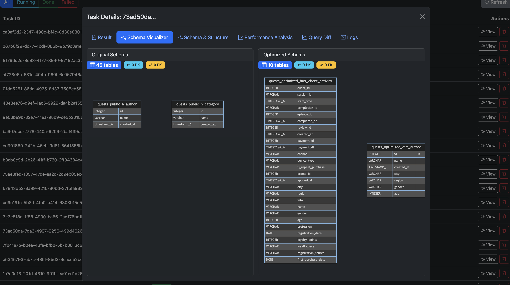

# Сервис оптимизации БД

FastAPI-сервис для автоматического анализа и оптимизации схем баз данных и SQL-запросов с использованием интеллектуальных конвейеров анализа. Сервис обрабатывает задачи оптимизации асинхронно и предоставляет детальные отчеты о производительности, скрипты миграции и переписанные запросы.

     Powered by **Llama 4 Maverick**

    Designed specifically for **Trino**

----
▶️ Демо находится [здесь](http://35.91.63.139)

Пример запроса к демо-сервису:

```bash
curl -X POST "http://35.91.63.139/new" \
  -H "Content-Type: application/json" \
  -d @flights.json
```
----

## Содержание

- [Обзор](#обзор)
- [Архитектура](#архитектура)
- [Возможности](#возможности)
- [Структура проекта](#структура-проекта)
- [Установка](#установка)
- [Использование](#использование)
- [Документация API](#документация-api)
- [Конфигурация](#конфигурация)
- [Запуск тестов](#запуск-тестов)


## Обзор

Сервис оптимизации баз данных анализирует схему вашей базы данных и SQL-запросы для выявления узких мест производительности, предложения оптимизаций и автоматической переписи запросов для повышения производительности. Он использует асинхронную обработку задач для работы с длительными заданиями анализа и предоставляет полный набор REST API для интеграции.

**Ключевые возможности:**
- Анализ и оптимизация схемы БД
- Переписывание и оптимизация SQL-запросов
- Выявление узких мест производительности
- Генерация скриптов миграции
- Рекомендации по материализованным представлениям
- Визуальные отчеты о производительности

## Архитектура


### Поток запросов


## Возможности

### Основной функционал

- **Асинхронная обработка**: Длительные задачи оптимизации выполняются в фоновом режиме
- **Анализ схемы**: Глубокий анализ структуры БД, связей и типов данных
- **Оптимизация запросов**: Автоматическое переписывание SQL-запросов для улучшения производительности
- **Генерация миграций**: Безопасные скрипты миграции для внедрения изменений схемы
- **Анализ производительности**: Выявление узких мест, медленных запросов и возможностей оптимизации

### Возможности анализа

- Распределение колонок и анализ типов данных
- Выявление паттернов JOIN
- Отслеживание использования агрегаций
- Рекомендации по материализованным представлениям
- Предложения по оптимизации индексов
- Метрики объема запросов и времени выполнения


### Возможности API

- RESTful API с документацией OpenAPI/Swagger
- Мониторинг статуса задач
- Детальные логи выполнения для отладки
- Визуализация различий в запросах
- Подробные отчеты анализа с данными для визуализации
- Управление задачами (список, удаление, фильтрация)

## Структура проекта

```
database-optimization-service/
├── app/
│   └── main.py                 # Точка входа FastAPI приложения
├── src/
│   ├── __init__.py
│   ├── crud.py                 # CRUD операции с БД
│   ├── database.py             # Настройка SQLAlchemy
│   ├── models.py               # Pydantic модели для API
│   ├── pipeline.py             # Главный конвейер анализа
│   ├── db_analyzer.py          # Анализатор схемы БД
│   ├── query_optimizer.py      # Логика оптимизации SQL-запросов
│   └── report_creator.py       # Генерация отчетов и скриптов миграции
├── static/
│   ├── css/
│   │   └── styles.css         
│   └── js/
│       └── app.js             # Frontend JavaScript
├── templates/
│   └── index.html             # Главный шаблон UI      
├── tests/
│   ├── __init__.py
│   ├── test_api.py            # Тесты API эндпоинтов
│   ├── test_pipeline.py       # Тесты конвейера
│   └── test_crud.py           # Тесты CRUD операций
├── .env.example               # Шаблон переменных окружения
├── .gitignore
├── requirements.txt           # Python зависимости
└── README.md                 
```

## Установка

### Требования

- Python 3.11 или выше

### Шаг 1: Клонирование репозитория

```bash
git clone https://github.com/AndreyStartsev/DTL2025
cd db_hack
```

### Шаг 2: Создание виртуального окружения

```bash
python -m venv venv
source venv/bin/activate  # На Windows: venv\Scripts\activate
```

### Шаг 3: Установка зависимостей

```bash
pip install -r requirements.txt
```

### Шаг 4: Настройка переменных окружения

```bash
cp .env.example .env
```

Отредактируйте файл `.env` со своими настройками:

```env
# Конфигурация LLM API
LLM_API_KEY=openrouter_api_key
LLM_MODEL=llama-4-maverick

# Конфигурация базы данных
DATABASE_URL=sqlite:///./optimization_tasks.db

# Настройки приложения
TASK_TIMEOUT_MINUTES=20
LOG_LEVEL=INFO
```

### Шаг 5: Запуск приложения

```bash
uvicorn app.main:app --reload --host 0.0.0.0 --port 8000
```

Сервис будет доступен по адресам:
- Веб-интерфейс: http://localhost:8000
- Документация API: http://localhost:8000/docs
- ReDoc: http://localhost:8000/redoc

## Использование

### Использование веб-интерфейса

1. Перейдите по адресу http://localhost:8000
2. Вставьте DDL-выражения вашей базы данных
3. Добавьте SQL-запросы с метриками выполнения
4. Нажмите "Submit for Analysis"
5. Отслеживайте статус задачи
6. Просмотрите результаты после завершения



### Использование API

#### 1. Создание новой задачи

```bash
curl -X POST "http://localhost:8000/new" \
  -H "Content-Type: application/json" \
  -d '{
    "url": "sqlite:///./test.db",
    "ddl": [
      {"statement": "CREATE TABLE users (id INT PRIMARY KEY, name VARCHAR(100));"}
    ],
    "queries": [
      {
        "queryid": "q1",
        "query": "SELECT * FROM users WHERE name LIKE '\''%john%'\''",
        "runquantity": 1000,
        "executiontime": 150
      }
    ]
  }'
```

#### 2. Проверка статуса задачи

```bash
curl "http://localhost:8000/status?task_id=550e8400-e29b-41d4-a716-446655440000"
```

#### 3. Получение результатов

```bash
curl "http://localhost:8000/getresult?task_id=550e8400-e29b-41d4-a716-446655440000"
```

#### 4. Получение отчета анализа

```bash
curl "http://localhost:8000/task/550e8400-e29b-41d4-a716-446655440000/analysis"
```


## Документация API

### Обзор эндпоинтов

| Эндпоинт | Метод | Описание |
|----------|--------|-------------|
| `/new` | POST | Создать новую задачу оптимизации |
| `/status` | GET | Проверить статус задачи |
| `/getresult` | GET | Получить результаты оптимизации |
| `/tasks` | GET | Список всех задач |
| `/task/{task_id}` | DELETE | Удалить конкретную задачу |
| `/task/{task_id}/log` | GET | Получить логи выполнения задачи |
| `/task/{task_id}/diff` | GET | Получить различия в запросах |
| `/task/{task_id}/analysis` | GET | Получить детальный отчет анализа |

### Интерактивная документация

Посетите следующие URL для интерактивной документации API:

- **Swagger UI**: http://localhost:8000/docs
- **ReDoc**: http://localhost:8000/redoc


## Конфигурация

### Переменные окружения

| Переменная | Описание | По умолчанию |
|----------|-------------|---------|
| `LLM_API_KEY` | API ключ для LLM сервиса | Обязательно |
| `LLM_MODEL` | Модель для анализа | `llama-4-maverick` |
| `DATABASE_URL` | URL базы данных SQLAlchemy | `sqlite:///./optimization_tasks.db` |
| `TASK_TIMEOUT_MINUTES` | Максимальное время выполнения задачи | `20` |
| `LOG_LEVEL` | Уровень логирования | `INFO` |

### Таймаут задач

Задачи, превышающие настроенный таймаут, автоматически помечаются как `FAILED`. Настройте `TASK_TIMEOUT_MINUTES` в зависимости от сложности типичной нагрузки.

## Запуск тестов

```bash
# Запустить все тесты
pytest

# Запустить с покрытием
pytest --cov=src --cov-report=html

# Запустить конкретный тестовый файл
pytest tests/test_api.py
```

## Развертывание с Docker

Сборка и запуск:

```bash
docker build -t db-optimization-service .
docker run -p 8000:8000 --env-file .env db-optimization-service
```


---

**Версия**: 1.0.0  
**Последнее обновление**: 01.10.2025